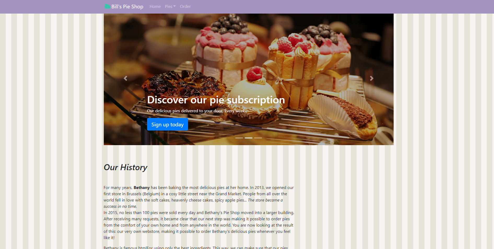
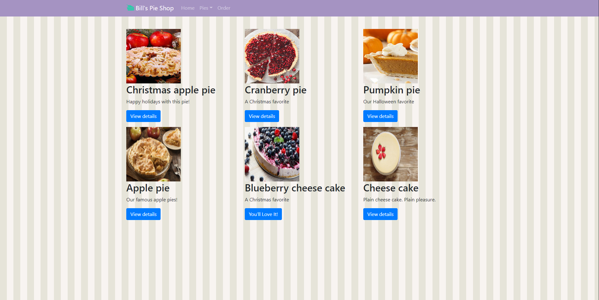
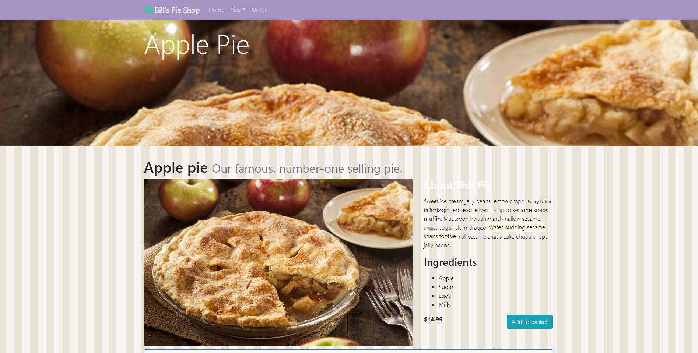
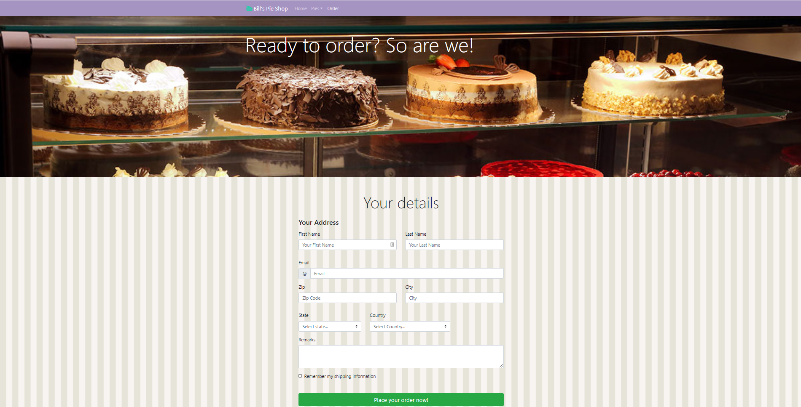

# Bootstrap Basics Website (React Version)

## Overview 

This project is my take on the project on Pluralsight's "Bootstrap: Getting Started" course by Gill Cleeren.
It was adapted and ported for use on React, then also adapted to use the existing [react-bootstrap](https://react-bootstrap.github.io/) library.

The course covered:

- Using bootstrap's layouts
- Bootstrap components
- Styling the components
- Forms






## Installation & Build

```
npm install
npm start 
OR
npm build
```